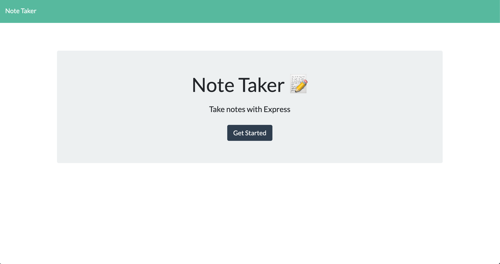

  # Note Taker
  

  ### [**Deployed App**](https://evening-refuge-78524.herokuapp.com/)

  ### Developed by [**Conrad Trost**](https://github.com/retro1967)

  ## Description
  #### Take notes and have them persist using JSON database storage. Runs on Express.

  

  
  

  ### Table of Contents:

  **[Description](#description)** 
  **[Installation Instructions](#installation-instructions)** 
  **[Usage Instructions](#usage-instructions)** 
  **[Contributions](#contributions)** 
  **[Test Instructions](#test-instructions)** 
  **[License](#license)** 
  **[Questions](#questions)** 

  ## Installation Instructions
  Clone the repository, run `npm i` at the root command line.

  ## Usage Instructions 
  To use, open the deployed app.

  ## Contributions
  Contributions are welcomed. Submit a pull request and contributions will be credited.

  ## Test Instructions
  N/A.

  ## License
  This application is covered under the [MIT](https://opensource.org/licenses/MIT) license.
  Visit the link above to learn more about this license.

  ## Questions

  Find me on [Github](https://github.com/retro1967)
  Email me with questions at conrad@trost.dev
